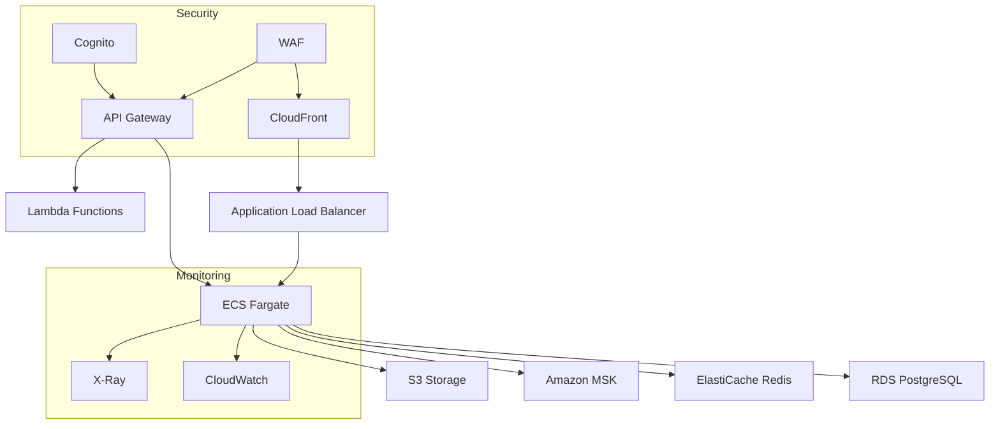

# AWS Architecture for AstroShield

## Infrastructure Overview

### Frontend Tier
- **AWS Amplify**
  - Hosting Next.js application
  - CI/CD pipeline integration
  - Environment management
  - Preview deployments
  - Custom domains and SSL

### API Tier
- **API Gateway**
  - REST API endpoints
  - WebSocket support for real-time features
  - Request throttling
  - API key management
  - OpenAPI integration

### Compute Tier
- **ECS Fargate**
  - Main application containers
  - Auto-scaling groups
  - Load balancing
  - Health monitoring
  - Resource optimization

### Database Tier
- **RDS (PostgreSQL)**
  - Primary data storage
  - Multi-AZ deployment
  - Automated backups
  - Point-in-time recovery
  - Read replicas for scaling

### Caching Tier
- **ElastiCache (Redis)**
  - Session management
  - API response caching
  - Real-time data caching
  - Pub/Sub capabilities

### Message Queue
- **Amazon MSK (Kafka)**
  - Event streaming
  - Real-time data processing
  - SASL/SSL security
  - Multi-AZ deployment

### Storage
- **S3**
  - Static assets
  - Data backups
  - Log archives
  - User uploads

### CDN
- **CloudFront**
  - Global content delivery
  - Edge caching
  - DDoS protection
  - SSL/TLS termination

### Security
- **Cognito**
  - User authentication
  - OAuth2/OIDC support
  - JWT token management
  - Social login integration

- **WAF**
  - Web application firewall
  - SQL injection protection
  - Rate limiting
  - IP blocking

- **Secrets Manager**
  - API keys
  - Database credentials
  - Service accounts
  - Certificate management

### Monitoring
- **CloudWatch**
  - Metrics collection
  - Log aggregation
  - Alarm management
  - Dashboard creation

- **X-Ray**
  - Distributed tracing
  - Performance monitoring
  - Error tracking
  - Service map visualization

## Network Architecture

## Deployment Strategy

### Frontend Deployment
1. Code push to repository
2. Amplify triggers build
3. Next.js build and optimization
4. Deploy to global CDN
5. Invalidate cache if needed

### Backend Deployment
1. Container build
2. Push to ECR
3. ECS task definition update
4. Rolling deployment
5. Health check verification

## Scaling Strategy

### Horizontal Scaling
- ECS Service auto-scaling
- RDS read replicas
- ElastiCache cluster scaling
- MSK partition management

### Vertical Scaling
- ECS task size adjustment
- RDS instance class updates
- ElastiCache node type updates

## Cost Optimization

### Development Environment
- Smaller instance types
- Reduced redundancy
- Spot instances where possible
- Development-tier RDS

### Production Environment
- Auto-scaling based on metrics
- Reserved instances for baseline
- S3 lifecycle policies
- CloudFront optimization

## Security Measures

### Network Security
- VPC isolation
- Security groups
- Network ACLs
- VPC endpoints

### Application Security
- WAF rules
- SSL/TLS encryption
- JWT token validation
- Rate limiting

### Data Security
- At-rest encryption
- In-transit encryption
- Backup encryption
- Key rotation

## Monitoring and Alerting

### Metrics
- Application metrics
- Infrastructure metrics
- Business metrics
- Cost metrics

### Alerts
- Service health
- Performance thresholds
- Security events
- Cost thresholds

## Disaster Recovery

### Backup Strategy
- RDS automated backups
- S3 cross-region replication
- Configuration backups
- State management

### Recovery Strategy
- Multi-AZ failover
- Cross-region recovery
- Data restoration
- Service reconstruction 