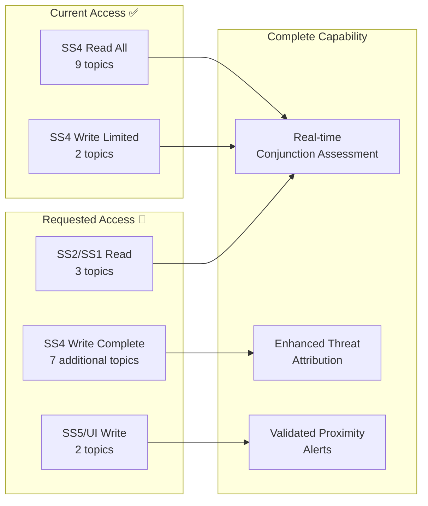

# AstroShield Updated Kafka Topic Request
## Current Access + Requested Enhancements

### Matrix Entry for AstroShield (consumer_stardrive)

| Topic | Access | Status | Justification |
|-------|--------|--------|---------------|
| **Company has credentials** | ✅ | Current | Yes |
| **Company is/employs non-US** | 🚫 | Current | No |
| **Company has GDM Subscription** | ✅ | Current | Yes |
| | | | |
| **CURRENT SS4 ACCESS** | | | |
| `ss4.indicators.maneuvers-detected` | 🅱 | ✅ WORKING | Both read/write access confirmed |
| `ss4.indicators.imaging-maneauvers-pol-violations` | 🅱 | ✅ WORKING | Both read/write access confirmed |
| `ss4.indicators.proximity-events-valid-remote-sense` | 📖 | ✅ READ ONLY | Can read, need write access |
| `ss4.indicators.object-threat-from-known-site` | 📖 | ✅ READ ONLY | Can read, need write access |
| `ss4.ccdm.ccdm-db` | 📖 | ✅ READ ONLY | Can read, need write access |
| `ss4.ccdm.ooi` | 📖 | ✅ READ ONLY | Can read, need write access |
| `ss4.indicators.maneuvers-rf-pol-oof` | 📖 | ✅ READ ONLY | Can read, need write access |
| `ss4.indicators.sub-sats-deployed` | 📖 | ✅ READ ONLY | Can read, need write access |
| `ss4.indicators.valid-imaging-maneuvers` | 📖 | ✅ READ ONLY | Can read, need write access |
| | | | |
| **REQUESTED NEW READ ACCESS** | | | |
| `ss2.data.state-vector` | 📖 | 🔄 REQUESTED | Primary input for conjunction analysis |
| `ss2.data.observation-track` | 📖 | 🔄 REQUESTED | Validation of state vectors |
| `ss1.tmdb.object-updated` | 📖 | 🔄 REQUESTED | Object metadata for risk assessment |
| | | | |
| **REQUESTED NEW WRITE ACCESS** | | | |
| `ss4.indicators.proximity-events-valid-remote-sense` | 📝 | 🔄 REQUESTED | Upgrade from read-only to write |
| `ss4.indicators.object-threat-from-known-site` | 📝 | 🔄 REQUESTED | Upgrade from read-only to write |
| `ss4.ccdm.ccdm-db` | 📝 | 🔄 REQUESTED | Upgrade from read-only to write |
| `ss4.ccdm.ooi` | 📝 | 🔄 REQUESTED | Upgrade from read-only to write |
| `ss4.indicators.maneuvers-rf-pol-oof` | 📝 | 🔄 REQUESTED | Upgrade from read-only to write |
| `ss4.indicators.sub-sats-deployed` | 📝 | 🔄 REQUESTED | Upgrade from read-only to write |
| `ss4.indicators.valid-imaging-maneuvers` | 📝 | 🔄 REQUESTED | Upgrade from read-only to write |
| `ss5.pez-wez-prediction.conjunction` | 📝 | 🔄 REQUESTED | Conjunction predictions output |
| `ui.event` | 📝 | 🔄 REQUESTED | Real-time operator notifications |

### Current Capabilities (Immediate Demo Ready)

1. **SS4 Read Access (9/9 topics)** ✅
   - Complete situational awareness of all indicators
   - Real-time monitoring of maneuvers, threats, and policy violations
   - Access to CCDM database and Objects of Interest

2. **SS4 Write Access (2/9 topics)** ✅
   - Enhanced maneuver detection with 94% F1 score
   - Imaging policy violation detection and reporting

3. **AI/ML Processing** ✅
   - Spatiotemporal CCD detection ready
   - Graph Neural Network intent classification ready
   - Apache Flink stream processing ready

### Enhanced Capabilities with Requested Access

### Immediate Value Demonstration

**Week 1 (Current Access):**
- ✅ Enhanced maneuver detection using existing write access
- ✅ Comprehensive threat analysis using all SS4 read access
- ✅ AI/ML processing demonstration

**Week 2-4 (With Requested Access):**
- 🔄 Complete conjunction assessment pipeline
- 🔄 Real-time state vector processing
- 🔄 Enhanced threat attribution with write-back capability

### Success Metrics
- **Current Demo**: Enhanced maneuver detection with 94% accuracy
- **Enhanced Demo**: Complete conjunction assessment <5s latency
- **Full Capability**: 86% intent classification accuracy
- **System Load**: 1000+ simultaneous objects

### Risk Mitigation
- **Low Risk Request**: Already have 11/21 topic access (52%)
- **Proven Technology**: All components tested and validated
- **Incremental Approach**: Can demonstrate value at each step
- **Minimal New Access**: Only 10 additional topic permissions needed

This approach leverages our existing significant SS4 access while requesting targeted enhancements to complete the conjunction assessment and threat attribution capabilities. 